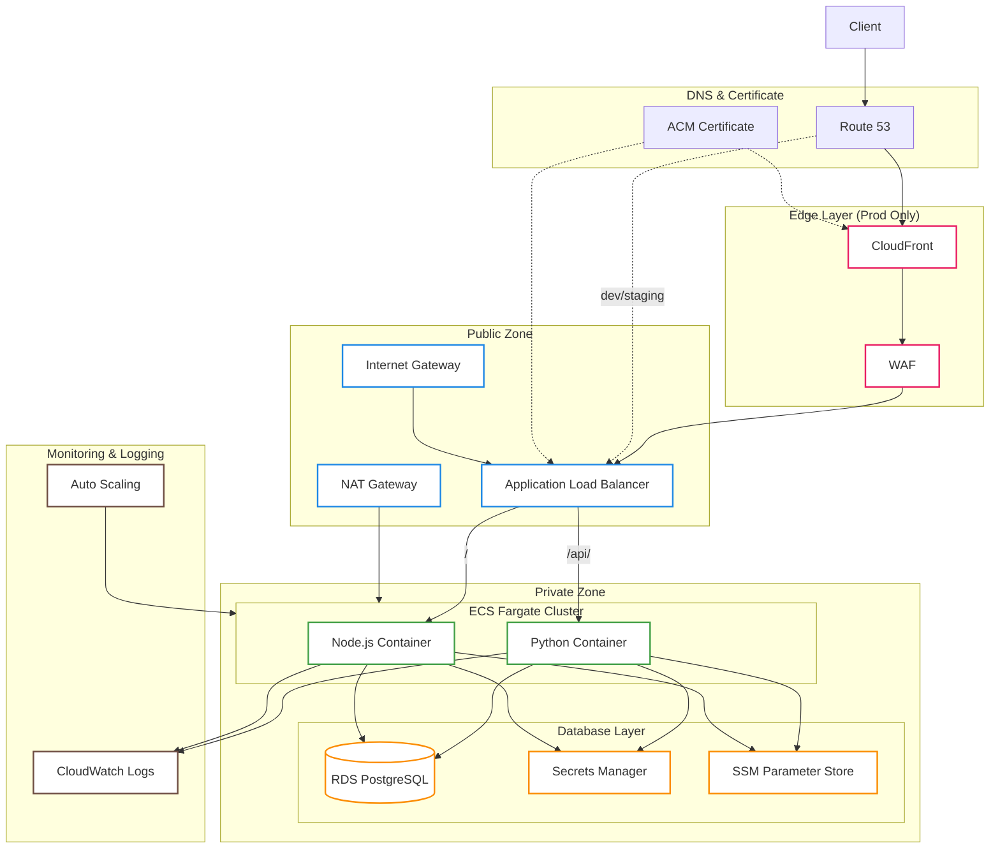
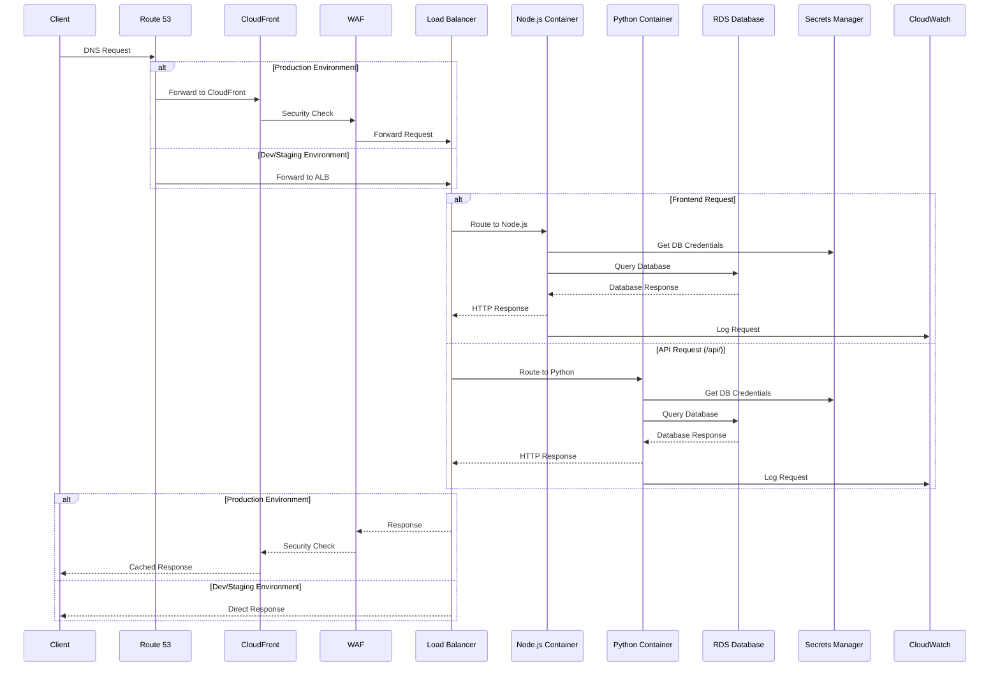
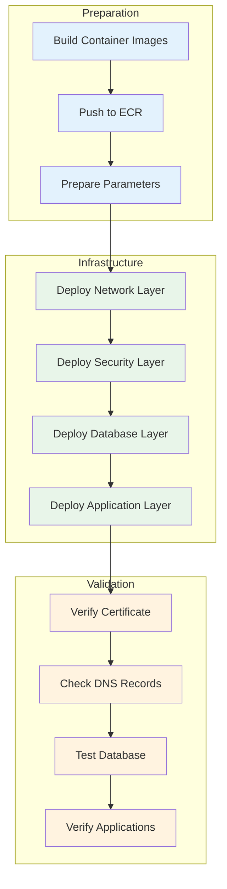

# AWS Infrastructure as Code - Multi-Environment Setup

This repository contains CloudFormation templates for deploying a complete production-ready infrastructure on AWS, supporting multiple environments (dev/staging/prod) with isolated networking and security configurations.

# AWS Infrastructure Diagrams

## Infrastructure Architecture


## Request Flow


## Deployment Workflow

## Architecture Components

### Network Layer
- VPC with public and private subnets across 2 AZs
- NAT Gateway for private subnet internet access
- Internet Gateway for public subnets
- Network ACLs and Security Groups

### Compute Layer
- ECS Fargate cluster
- Auto-scaling configuration (CPU/Memory based)
- Node.js and Python containers
- Application Load Balancer with path-based routing

### Database Layer
- RDS PostgreSQL in private subnet
- Automated password rotation
- Automated backups
- Secure credential management

### Security Layer
- HTTPS-only access (with automatic HTTP to HTTPS redirect)
- ACM certificates with automatic DNS validation
- Secrets Manager for database credentials
- IAM roles with least privilege access
- Security groups with minimal required access

## Prerequisites

### Required Tools
```bash
# AWS CLI
curl "https://awscli.amazonaws.com/awscli-exe-linux-x86_64.zip" -o "awscliv2.zip"
unzip awscliv2.zip
sudo ./aws/install

# Configure AWS CLI
aws configure
```

### Required AWS Resources
1. AWS Account with appropriate permissions
2. Route 53 Hosted Zone for your domain
3. ECR repositories for your containers:
   ```bash
   # Create ECR repositories
   aws ecr create-repository --repository-name node-app
   aws ecr create-repository --repository-name python-app
   ```

### Application Requirements
1. Node.js application with:
   - `/health` endpoint for ALB health checks
   - Configuration via environment variables
   - Containerized with multi-stage Dockerfile

2. Python application with:
   - `/health` endpoint for ALB health checks
   - Configuration via environment variables
   - Containerized with multi-stage Dockerfile

## Container Setup

### Node.js Application
```dockerfile
FROM node:18-alpine as builder
WORKDIR /app
COPY package*.json ./
RUN npm ci
COPY . .
RUN npm run build

FROM node:18-alpine
WORKDIR /app
COPY --from=builder /app/dist ./dist
COPY package*.json ./
RUN npm ci --production
EXPOSE 3000
CMD ["npm", "start"]
```

### Python Application
```dockerfile
FROM python:3.11-slim as builder
WORKDIR /app
COPY requirements.txt .
RUN pip install -r requirements.txt
COPY . .

FROM python:3.11-slim
WORKDIR /app
COPY --from=builder /app .
EXPOSE 5000
CMD ["python", "app.py"]
```

## Deployment Instructions

### 1. Environment Preparation
```bash
# Get your Route 53 Hosted Zone ID
aws route53 list-hosted-zones --query 'HostedZones[].Id' --output text

# Build and push containers
aws ecr get-login-password --region us-east-1 | docker login --username AWS --password-stdin $AWS_ACCOUNT.dkr.ecr.us-east-1.amazonaws.com

docker build -t node-app ./node
docker tag node-app:latest $AWS_ACCOUNT.dkr.ecr.us-east-1.amazonaws.com/node-app:latest
docker push $AWS_ACCOUNT.dkr.ecr.us-east-1.amazonaws.com/node-app:latest

docker build -t python-app ./python
docker tag python-app:latest $AWS_ACCOUNT.dkr.ecr.us-east-1.amazonaws.com/python-app:latest
docker push $AWS_ACCOUNT.dkr.ecr.us-east-1.amazonaws.com/python-app:latest
```

### 2. Stack Deployment
```bash
# Create a parameters file
cat > parameters.json << EOF
[
  {
    "ParameterKey": "Env",
    "ParameterValue": "dev"
  },
  {
    "ParameterKey": "HostedZoneName",
    "ParameterValue": "example.com"
  },
  {
    "ParameterKey": "HostedZoneId",
    "ParameterValue": "Z1234567890"
  },
  {
    "ParameterKey": "NodeContainerImage",
    "ParameterValue": "$AWS_ACCOUNT.dkr.ecr.us-east-1.amazonaws.com/node-app:latest"
  },
  {
    "ParameterKey": "PythonContainerImage",
    "ParameterValue": "$AWS_ACCOUNT.dkr.ecr.us-east-1.amazonaws.com/python-app:latest"
  }
]
EOF

# Deploy the stack
aws cloudformation create-stack \
  --stack-name my-infrastructure \
  --template-body file://infrastructure.yml \
  --parameters file://parameters.json \
  --capabilities CAPABILITY_NAMED_IAM
```

### 3. Monitoring Deployment
```bash
# Watch stack creation progress
aws cloudformation describe-stack-events \
  --stack-name my-infrastructure \
  --query 'StackEvents[?ResourceStatus==`CREATE_IN_PROGRESS`]'

# Get stack outputs
aws cloudformation describe-stacks \
  --stack-name my-infrastructure \
  --query 'Stacks[0].Outputs'
```

## Post-Deployment Verification

### 1. Certificate Validation
```bash
# Check certificate status
aws acm describe-certificate \
  --certificate-arn $(aws cloudformation describe-stacks \
    --stack-name my-infrastructure \
    --query 'Stacks[0].Outputs[?OutputKey==`ACMCertificateARN`].OutputValue' \
    --output text)
```

### 2. Database Connection
```bash
# Get RDS endpoint
aws cloudformation describe-stacks \
  --stack-name my-infrastructure \
  --query 'Stacks[0].Outputs[?OutputKey==`RDSEndpoint`].OutputValue' \
  --output text

# Get database credentials
aws secretsmanager get-secret-value \
  --secret-id $(aws cloudformation describe-stacks \
    --stack-name my-infrastructure \
    --query 'Stacks[0].Outputs[?OutputKey==`RDSSecretARN`].OutputValue' \
    --output text)
```

### 3. Application Health
```bash
# Get application URL
export APP_URL=$(aws cloudformation describe-stacks \
  --stack-name my-infrastructure \
  --query 'Stacks[0].Outputs[?OutputKey==`ApplicationURL`].OutputValue' \
  --output text)

# Check health endpoints
curl -k "${APP_URL}/health"
curl -k "${APP_URL}/api/health"
```

## Troubleshooting Guide

### Common Issues

1. **Certificate Validation Fails**
   ```bash
   # Check DNS validation records
   aws acm describe-certificate \
     --certificate-arn $CERT_ARN \
     --query 'Certificate.DomainValidationOptions'
   ```

2. **Container Health Check Failures**
   ```bash
   # Check container logs
   aws logs get-log-events \
     --log-group-name /ecs/dev/node-app \
     --log-stream-name $(aws logs describe-log-streams \
       --log-group-name /ecs/dev/node-app \
       --query 'logStreams[0].logStreamName' \
       --output text)
   ```

3. **Database Connection Issues**
   ```bash
   # Verify security group rules
   aws ec2 describe-security-groups \
     --group-ids $RDS_SG_ID \
     --query 'SecurityGroups[0].IpPermissions'
   ```

### Monitoring and Logs

1. **ECS Service Logs**
   ```bash
   # Get task definition
   aws ecs describe-task-definition \
     --task-definition $(aws ecs list-task-definitions \
       --family-prefix dev-app \
       --query 'taskDefinitionArns[0]' \
       --output text)
   ```

2. **Load Balancer Metrics**
   ```bash
   # Get ALB metrics
   aws cloudwatch get-metric-statistics \
     --namespace AWS/ApplicationELB \
     --metric-name RequestCount \
     --dimensions Name=LoadBalancer,Value=$ALB_NAME \
     --start-time $(date -u +"%Y-%m-%dT%H:%M:%SZ" -d "1 hour ago") \
     --end-time $(date -u +"%Y-%m-%dT%H:%M:%SZ") \
     --period 300 \
     --statistics Sum
   ```

## Maintenance

### Updating Applications
```bash
# Deploy new container version
aws ecs update-service \
  --cluster dev-cluster \
  --service dev-service \
  --force-new-deployment
```

### Database Maintenance
```bash
# Create manual snapshot
aws rds create-db-snapshot \
  --db-instance-identifier dev-RDS \
  --db-snapshot-identifier manual-backup-$(date +%Y%m%d)
```

### Scaling Adjustments
```bash
# Modify auto-scaling settings
aws application-autoscaling put-scaling-policy \
  --policy-name dev-cpu-scaling \
  --policy-type TargetTrackingScaling \
  --resource-id service/dev-cluster/dev-service \
  --scalable-dimension ecs:service:DesiredCount \
  --service-namespace ecs \
  --target-tracking-scaling-policy-configuration file://scaling-policy.json
```

## Security Considerations

1. **Network Security**
   - All private resources in private subnets
   - NAT Gateway for outbound traffic
   - Security groups with minimal access

2. **Data Security**
   - Encrypted RDS storage
   - Secrets rotation enabled
   - HTTPS-only access

3. **Access Control**
   - IAM roles with least privilege
   - No direct database access
   - ECS Exec for debugging

## Cost Optimization

Monitor and optimize costs for:
1. NAT Gateway (hourly + data transfer)
2. RDS instance (consider reserved instances)
3. Application Load Balancer
4. ECS Fargate tasks
5. CloudWatch Logs retention

## Support and Maintenance

For issues or improvements:
1. Check CloudWatch Logs
2. Review security group configurations
3. Verify DNS settings
4. Check container health endpoints
5. Review ECS service events

## License

This project is licensed under the MIT License - see the LICENSE file for details.
